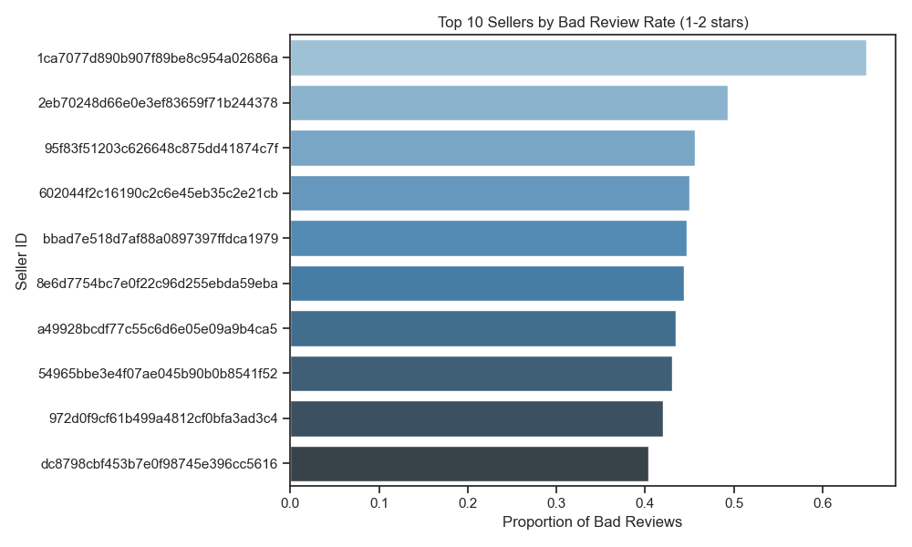

# EDA Visual Summary
## Summary of Visuals
- Share of Late Deliveries: Majority orders are on time.
- Review Score Distribution: Most customers leave 5-star reviews.
- Delay vs Review: Late deliveries lead to more negative reviews. 
- Under-performing Sellers: Certain sellers consistently show higher average delays and more bad reviews.

### Share of Late Deliveries

### Review Score Distribution

### Delay vs Review Sentiment

-----

## Under-performing Sellers

Analysis based on delivery delay and negative review rate reveals key under-performers:

- Sellers with the highest **average delivery delays** can be targeted for logistics improvements.
- Sellers with the highest **rate of 1-2 star reviews** highlight areas of poor customer satisfaction.

These insights support:
-  Better seller vetting
-  Smarter logistics partnerships
-  Regional performance optimization

### Top Sellers by Delivery Delay

### Top Sellers by Bad Reviews

### 🗺️ Top States by Avg Delivery Delay

--------

## What are problematic orders?

Orders with:
- Late delivery (`is_late == 1`) OR
- Poor review score (≤ 2)

## Summary of the model

- **Features used**: `wait_time`, `price`, `freight_value`

**Business Implications:**

Our predictive model allows Trendify to identify potentially problematic orders *before* they occur. 
This means:

-  Operations teams can prioritize high-risk orders for proactive intervention (e.g., faster fulfillment or improved communication).
-  Customer service can better anticipate complaints and prepare solutions.
-  Sellers with consistently flagged orders can be evaluated and supported for better service (can be monitored).

With this intelligence, Trendify can boost customer satisfaction and retention, while reducing complaint-related costs.

*Note: The model achieves ~87% accuracy with strong performance in identifying non-problematic orders. Performance on problematic orders (precision: 70%, recall: 48%) gives a good starting point for risk flagging.*

###  Confusion Matrix of Predictive Model

